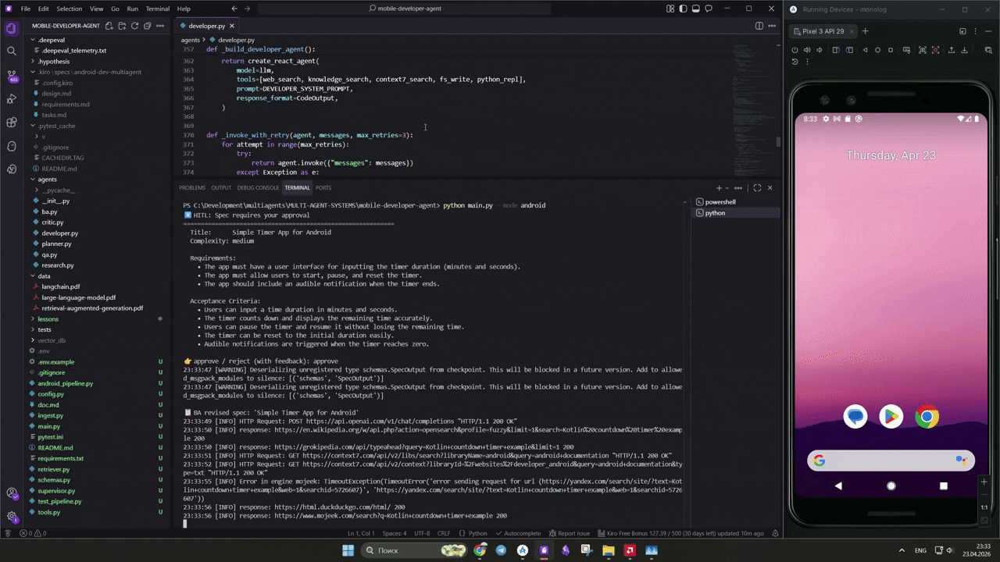

# Mobile Apps Developer Agent



A multi-agent system that takes a user story and autonomously generates a complete, buildable Android application using Jetpack Compose. The pipeline covers business analysis, research, code generation, and QA — all orchestrated via LangGraph.

## Architecture

```
User Story
  │
  ▼
Business Analyst Agent  →  SpecOutput (requirements + acceptance criteria)
  │
  ▼
Developer Agent         →  Android Gradle project written to output/{slug}/
  │
  ▼
QA Engineer Agent       →  ReviewOutput (build + ADB validation)
  │
  └── REVISION_NEEDED → back to Developer (max 2 rounds)
  │
  ▼
output/{slug}/          →  Complete buildable Android project
```

Supporting agents used within the pipeline:

```
Planner Agent    →  ResearchPlan (search queries + sources)
Researcher Agent →  findings (markdown report)
Critic Agent     →  CritiqueResult (APPROVE / REVISE)
```

## Project Structure

```
├── agents/
│   ├── ba.py           # Business Analyst → SpecOutput
│   ├── developer.py    # Developer → Android project files
│   ├── qa.py           # QA Engineer → ReviewOutput
│   ├── planner.py      # Planner → ResearchPlan
│   ├── research.py     # Researcher → findings report
│   └── critic.py       # Critic → CritiqueResult
├── docs/
│   ├── ba.md           # BA agent documentation
│   ├── developer.md    # Developer agent documentation
│   ├── qa.md           # QA agent documentation
│   ├── planner.md      # Planner agent documentation
│   ├── research.md     # Researcher agent documentation
│   └── critic.md       # Critic agent documentation
├── tests/
│   ├── golden_dataset.json
│   ├── conftest.py
│   ├── test_android_ba.py
│   ├── test_android_developer.py
│   ├── test_android_qa.py
│   ├── test_android_e2e.py
│   ├── test_android_properties.py
│   ├── test_planner.py
│   ├── test_researcher.py
│   ├── test_critic.py
│   ├── test_tools.py
│   └── test_e2e.py
├── data/               # PDF documents for RAG knowledge base
├── vector_db/          # FAISS index + BM25 chunks
├── output/             # Generated Android projects
├── android_pipeline.py # Android pipeline entry point
├── main.py             # Research REPL with HITL loop
├── supervisor.py       # Supervisor orchestration
├── schemas.py          # Pydantic models
├── tools.py            # Shared tools (search, fs, ADB, Gradle)
├── retriever.py        # Hybrid FAISS + BM25 + reranker
├── ingest.py           # PDF ingestion pipeline
├── config.py           # Settings + system prompts
└── requirements.txt
```

## Agent Documentation

| Agent | Role | Doc |
|-------|------|-----|
| Business Analyst | Converts user story into a structured spec | [docs/ba.md](docs/ba.md) |
| Developer | Generates the full Android Gradle project | [docs/developer.md](docs/developer.md) |
| QA Engineer | Builds, installs, and validates the app | [docs/qa.md](docs/qa.md) |
| Planner | Decomposes research requests into search plans | [docs/planner.md](docs/planner.md) |
| Researcher | Executes web and knowledge base searches | [docs/research.md](docs/research.md) |
| Critic | Reviews research findings and approves or requests revision | [docs/critic.md](docs/critic.md) |

## Setup

### 1. Clone and install dependencies

```bash
pip install -r requirements.txt
```

### 2. Configure environment

```bash
cp .env.example .env
```

Edit `.env` with your API keys:

```env
# Primary LLM (Gemini)
GOOGLE_API_KEY=your-google-gemini-api-key-here
MODEL_NAME=gemini-2.5-flash

# Required for embeddings (text-embedding-3-small)
OPENAI_API_KEY=your-openai-api-key-here
```

> Get your Google Gemini API key at [aistudio.google.com](https://aistudio.google.com/app/apikey)
> Get your OpenAI API key at [platform.openai.com](https://platform.openai.com/api-keys)

### 3. Build the RAG knowledge base

Ingest the PDF documents in `data/` into the local FAISS vector index:

```bash
python ingest.py
```

### 4. Run the Android pipeline

```bash
python android_pipeline.py
```

You will be prompted to enter a user story, e.g.:

```
Enter user story: Build a simple countdown timer app for Android
```

The pipeline will produce a complete Android project under `output/`.

### 5. (Optional) Run the research REPL

```bash
python main.py
```

## Running Tests

```bash
# All tests via DeepEval
deepeval test run tests/

# Specific suite
deepeval test run tests/test_android_e2e.py

# With verbose output
deepeval test run tests/ -v

# Plain pytest
python -m pytest tests/ -v
```

### Test Coverage

| File | What it tests |
|------|---------------|
| `test_android_ba.py` | BA spec structure and quality |
| `test_android_developer.py` | Generated file completeness |
| `test_android_qa.py` | QA review verdict correctness |
| `test_android_e2e.py` | Full pipeline on golden dataset |
| `test_android_properties.py` | Property-based edge case testing |
| `test_planner.py` | Plan structure and query count |
| `test_researcher.py` | Research groundedness and completeness |
| `test_critic.py` | Critique quality and verdict consistency |
| `test_tools.py` | Tool correctness per agent |
| `test_e2e.py` | Research pipeline end-to-end |

## Configuration

| Setting | Default | Description |
|---------|---------|-------------|
| `MODEL_NAME` | `gemini-2.5-flash` | LLM for all agents |
| `GOOGLE_API_KEY` | — | Gemini API key |
| `OPENAI_API_KEY` | — | OpenAI key for embeddings |
| `EMBEDDING_MODEL` | `all-MiniLM-L6-v2` | Local sentence-transformers model |
| `MAX_SEARCH_RESULTS` | `5` | Web search results per query |
| `TOP_K_RETRIEVAL` | `10` | RAG candidates before reranking |
| `TOP_K_RERANK` | `3` | Final RAG results after reranking |
| `OUTPUT_DIR` | `output` | Where generated projects are saved |

## Requirements

- Python 3.11+
- Android SDK (for Gradle builds)
- ADB (optional, for device testing)
- Active internet connection (web search + API calls)
